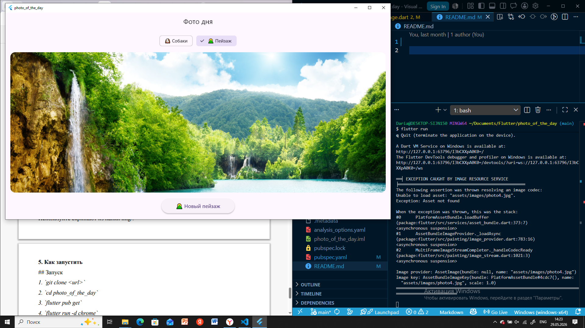

# Лабораторная работа №5. Асинхронность в Dart и Flutter. Создание приложения «Фото дня»

## Информация об авторе

**ФИО:** Черкина Дарья Алексеевна
**Группа:** ИСП-231

## Стек и версии
- environment: sdk: ^3.11.0
-dependencies: flutter: sdk: flutter http: ^1.6.0

## Скриншот приложения



### Установка и запуск
1. Клонировать репозиторий

 ```bash
   git clone <URL_вашего_репозитория>
   cd slot_machine
   flutter pub get
   flutter run -d edge
```

2. Перейти в папку проекта:

```bash
cd photo_of_the_day
```
3. Установить зависимости:

```bash
flutter pub get
```

4. Запустить приложение в Chrome:

```bash
flutter run -d chrome
```

## Что изучили
- Работа с Future и асинхронными операциями в Dart

- Использование ключевых слов async / await для управления асинхронным кодом

- Отправка HTTP-запросов с помощью пакета http

- Парсинг JSON-ответов с помощью jsonDecode()

- Управление состоянием UI через setState() во время асинхронных операций

- Работа с виджетами: CircularProgressIndicator, Image.network, Image.asset, ChoiceChip

## Ответы на вопросы
1. Что такое Future? Чем отличается от обычного возвращаемого значения?

Future — это объект, который представляет собой результат асинхронной операции, который будет доступен в будущем. В отличие от обычного возвращаемого значения, которое доступно сразу, Future позволяет не блокировать выполнение программы на время ожидания результата (например, ответа от сервера). Обычная функция возвращает значение синхронно, а асинхронная — возвращает Future, который «заполнится» позже.

2. Что делает await? Блокирует ли он весь поток выполнения?

await приостанавливает выполнение только текущей асинхронной функции до тех пор, пока Future не завершится. Он не блокирует весь поток выполнения — другие части программы (например, UI) продолжают работать. Это ключевое отличие от синхронного ожидания.

3. Зачем setState() вызывается дважды в _fetchPhoto()?

Первый вызов — в начале метода: устанавливает _isLoading = true и сбрасывает _imageUrl / _errorMessage, чтобы показать индикатор загрузки и скрыть предыдущее фото.

Второй вызов — в конце (в блоке finally или после try/catch): устанавливает _isLoading = false, чтобы скрыть индикатор, и обновляет _imageUrl или _errorMessage в зависимости от результата.

4. Почему кнопке передаётся _fetchPhoto без скобок, а не _fetchPhoto()?

Потому что в onPressed нужно передать ссылку на функцию, а не результат её вызова. Если написать _fetchPhoto(), функция выполнится сразу при построении виджета. Без скобок — функция будет вызвана только при нажатии кнопки.

5. Чем Image.network() отличается от Image.asset()?

- ​Image.network() загружает и отображает изображение динамически по ссылке (URL) из внешних источников в сети Интернет в реальном времени.
- ​Image.asset() загружает статическое изображение, которое заранее сохранено локально внутри проекта (в папке ресурсов, например assets/images/) и прописано в конфигурационном файле pubspec.yaml.